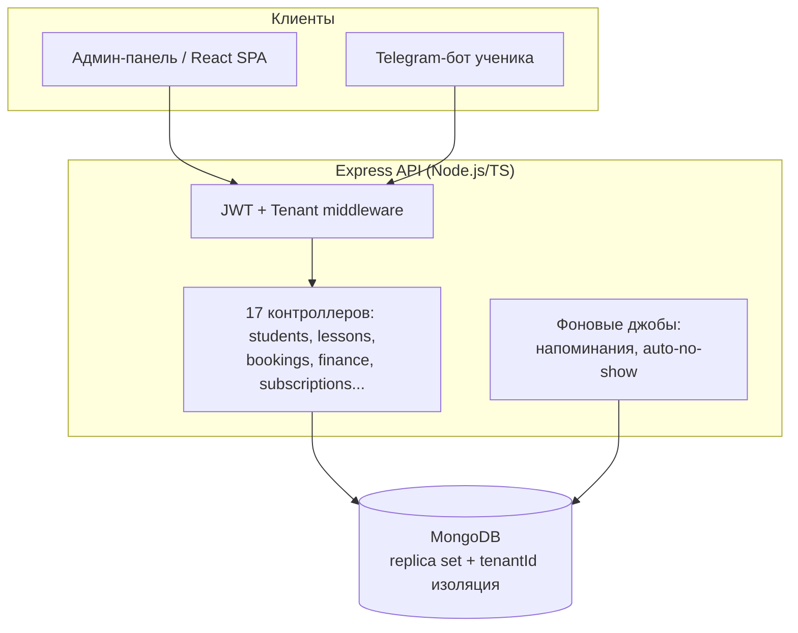

# Multi-Tenant SaaS CRM для сферы услуг (образование + аренда помещений)

> ⚠️ **NDA-заметка**: это анонимизированное описание реального продакшн-проекта. Название компании-клиента, домен/IP продакшн-сервера, учётные данные и часть бизнес-специфики скрыты по соглашению о неразглашении. Исходный код закрыт; здесь — архитектурное описание, инженерные решения и метрики, которые я могу раскрывать публично. Полное демо и код — по запросу, под NDA.

## TL;DR

Как соло-разработчик спроектировал, построил и эксплуатирую production SaaS CRM для образовательного центра (студия вокала/музыки) с арендой репетиционных помещений: управление учениками, абонементами, занятиями, финансами, преподавателями и Telegram-бронированием. Полный цикл: архитектура → разработка → тестирование → деплой → поддержка на боевых данных.

- **Роль**: Fullstack-разработчик / архитектор (соло, AI-ассистированная разработка — Claude Code)
- **Срок**: с марта 2026, в активной эксплуатации
- **Масштаб**: ~35 моделей/контроллеров, 17 API-групп, 17 фронтенд-страниц, 350+ автотестов
- **Статус**: production, реальные пользователи (ученики, преподаватели, администратор)

---

## Стек

| Слой | Технологии |
|---|---|
| Backend | Node.js, Express, TypeScript, Mongoose |
| Frontend | React, Vite, Material-UI, Redux Toolkit |
| БД | MongoDB (replica set — обязателен для транзакций) |
| Auth | JWT (HS256), bcrypt |
| Bot | grammY (Telegram, long polling) |
| Инфраструктура | PM2 (cluster mode), nginx, VPS |
| Тесты | bash+curl (API), Playwright (E2E), ts-node (DB-интеграционные) |

---

## Задача

Бизнес-клиент вёл учёт учеников, абонементов, занятий и финансов вручную (таблицы + мессенджеры). Нужна была система, которая:

1. автоматизирует расписание и бронирование (в т.ч. через Telegram — без отдельного приложения для клиентов),
2. считает деньги и комиссии преподавателей без ручных сверок,
3. масштабируется на несколько филиалов/тенантов в будущем без переписывания с нуля,
4. работает надёжно на очень ограниченном бюджете инфраструктуры.

## Архитектура

### Ключевые инженерные решения

**Multi-tenancy на shared DB.** Каждый документ несёт `tenantId`, все индексы составные с `tenantId`-префиксом, каждый запрос проходит через `tenantFilter`/`tenantAggregateMatch`. Архитектура готова к появлению второго клиента без миграции на отдельные БД.

**Recurrence-движок для занятий и бронирований.** Поддержка конечных и бесконечных повторяющихся серий (еженедельные занятия/аренда) с виртуальным расширением "на лету" — без материализации тысяч записей в БД. Отдельно решена проблема точечных исключений из серии (перенос/отмена одного occurrence) без дублей — через паттерн EXDATE, знакомый по iCal.

**Telegram как основной клиентский интерфейс.** Вместо отдельного мобильного приложения — бот с авторизацией по номеру телефона, личным кабинетом (расписание, абонемент, посещаемость, задолженность) и самостоятельным бронированием слотов с учётом бизнес-лимитов (авансовое окно, лимит активных броней, cooldown на отмену).

**Безопасность как осознанный набор компромиссов, а не чек-лист.** JWT с явным whitelist алгоритмов (защита от algorithm confusion), санитизация NoSQL-инъекций, rate limiting по типам эндпоинтов, Joi-валидация с `stripUnknown` (защита от подмены `tenantId`/`isSuperAdmin` через импорт CSV), RBAC с ownership-проверками на уровне контроллеров. Решения вроде "не переходить на httpOnly cookies сейчас" или "CAPTCHA не нужна на этом этапе" — задокументированы с обоснованием, а не забыты.

**Финансовый учёт с автоматическим каскадом.** Продажа абонемента/услуги/оплата брони автоматически создаёт финансовую запись; удаление каскадно откатывает связанные записи; комиссии преподавателей считаются по трём схемам (процент/фикс/комбо) без ручного пересчёта.

**Soft delete + корзина как единственная точка необратимого удаления.** Все DELETE — мягкие; админ может восстановить или удалить окончательно только через отдельный раздел — защита от случайной потери данных.

**Аудит-журнал** всех значимых действий (создание/изменение/удаление) с TTL-очисткой, доступный админу для расследования инцидентов.

---

## Тестирование

Тесты — не для галочки, а потому что деплой на единственный продакшн-сервер без staging-окружения не прощает регрессий:

- **~224 API-проверки** (bash + curl) — 14 фаз CRUD и бизнес-логики, гоняются против прода после каждого деплоя
- **89+ E2E-тестов** (Playwright, 17 сценарных файлов) — локально, включая конфликты бронирований, RBAC-ограничения преподавателя, бесконечные серии
- **~50 интеграционных тестов** (ts-node) — изоляция тенантов, транзакции, агрегации

## Эксплуатация в условиях жёстких ограничений

Продакшн крутится на бюджетном VPS с 957MB RAM — сборка фронтенда/бэкенда на таком объёме памяти нестабильна, поэтому пайплайн деплоя: **билд локально → пуш в приватный репозиторий → `git pull` + `pm2 restart` на сервере**. Отдельно решена проблема блокировки Telegram API на уровне провайдера (DPI) — задокументирован runbook с IPv4-пином и fallback-прокси.

## Осознанный технический долг

Открыто зафиксировано и приоритизировано (не скрыто под ковёр):
- 5 конкретных нарушений SOLID в контроллерах — запланирован отдельный релиз на чистый рефакторинг без новой функциональности
- HTTPS/PWA/secure-context API заблокированы до покупки домена — список того, что разблокируется, задокументирован
- Self-service восстановление пароля — временно решается вручную админом, до появления SMTP-инфраструктуры

---

## Что скрыто по NDA

- Название и контакты компании-клиента
- Домен/IP продакшн-сервера, учётные данные, ключи
- Исходный код контроллеров/моделей (доступен по запросу под соглашение)
- Реальные данные пользователей (ученики, преподаватели, финансы)

## Контакты

Готов показать живое демо на анонимизированных тестовых данных и ответить на технические вопросы по архитектуре — пишите.

## Скриншоты

